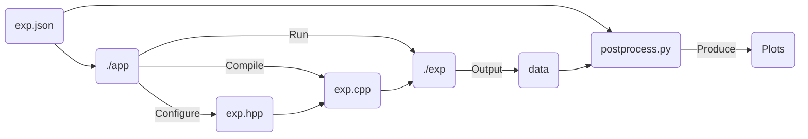

<div id="motion-planning-toolbox-logo" align="center">
    <br />
    
    <h1>Motion Planning Toolbox</h1>
    <h3></h3>
</div>

[](https://github.com/tschmoderer/motion-planning-toolbox/search?l=c%2B%2B&type=code)  [](https://github.com/tschmoderer/motion-planning-toolbox/actions/workflows/cmake.yml) [](https://tschmoderer.github.io/motion-planning-toolbox/html/index.html) [](https://github.com/tschmoderer/motion-planning-toolbox/blob/master/LICENSE) [](https://github.com/tschmoderer/motion-planning-toolbox/releases)

A C++ toolbox for the computation of trajectories of control systems.

The library is intended to be used from a single .json file. 

All parameters and functions for one or several experiments are set in a .json file. Then the application will parse and configure the application to run the experiments. 

# Demo

In a simple *.json* file we define all parameters for one or several experiments (i.e. simulation of a dynamical or a control system). We define the dynamics, we set the output variables and the postprocessing options.

This section describe a configuration file for a simulation of the Van der Pol oscilator

```math
\begin{pmatrix}\dot{x}_1 \\ \dot{x}_2 \end{pmatrix} = \begin{pmatrix}{x}_2 \\ \mu(1-(x_1)^2)x_2-x_1 \end{pmatrix}
```

<details><summary>Example of a .json configuration file: <i>exp.json</i> </summary>
<p>
    
```json
{
    "experiences": [
        {
            "type": "dynamical",
            "name": "vanderpol",
            "run": true,
            
            "general": {    
                "state_dim": 2,
                "start_time": 0,
                "end_time": 20,
                "x0": [
                    [2, 0], 
                    [-4, 1],
                    ["sqrt(2)", "1/2"]
                ]
            },
            
            "dynamics": {
                "parameters": {
                    "mymu": 1
                },

                "f": [
                    "dxdt(0) = x(1);",
                    "dxdt(1) = mymu*(1-x(0)*x(0))*x(1)-x(0);"
                ],

                "dfdx": [
                    "dxdt_dx(0,0) = 0;" ,
                    "dxdt_dx(0,1) = 1;",
                    "dxdt_dx(1,0) = -mymu*x(1)*x(0)/2.-1;",
                    "dxdt_dx(1,1) = mymu*(1-x(0)*x(0));"
                ]
            },

            "discretisation": {
                "trajectory": 513
            },

            "methods": { 
                "ode_int": "RK4"
            },
            
            "output": {
                "cli": false,
                "file": {
                    "yn": true,
                    "dir": "./results/",
                    "filename": "trajectory.dat"
                }
            }, 

            "postprocess": {
                "plots": [
                    {
                        "data": {
                            "x": 0,
                            "y": 1,
                            "nb": 1
                        },
                        "type": "line", 
                        "title": "Evolution the x_1 coordinate over time for the first initial condition",
                        "xlabel": "Time",
                        "ylabel": "x_1",
                        "output": {
                            "gui": false, 
                            "file": {
                                "yn": true, 
                                "dir": "./results/", 
                                "filename": "x1_coordinate.png"
                            }
                        }

                    }, 

                    {
                        "data": {
                            "x": 1,
                            "y": 2,
                            "nb": 0
                        },
                        "type": "line",
                        "title": "Phase diagram of all initial conditions",
                        "xlabel": "x_1",
                        "ylabel": "x_2",
                        
                        "output": {
                            "gui": true,
                            "file": {
                                "yn": true, 
                                "dir": "./results/", 
                                "filename": "phase.png"
                            }
                        }
                    },

                    {
                        "data": {
                            "x": 0,
                            "y": 2,
                            "nb": 0
                        },
                        "type": "line",
                        "title": "Evolution the x_2 coordinate over time for all initial conditions",
                        "xlabel": "time",
                        "ylabel": "x_2",
                        
                        "output": {
                            "gui": true,
                            "file": {
                                "yn": true, 
                                "dir": "./results/", 
                                "filename": "x2_coordinate_all.png"
                            }
                        }
                    }
                ]
            }
        }
    ]
}
```
    
</p>
</details>

Then using the following commands

```bash
mkdir build
cd build
cmake ..
make 
cd ../app
./mpp_app ./exp.json 
python3 postprocess.py exp.json
```

produce :

<table>
  <tr>
    <td> </td>
    <td></td>
   </tr> 
    <tr>
    </tr>
   <tr>
      <td></td>
  </tr>
</table>

The workflow of the app is as follows:




# Install & Building

## Requirement 
* Eigen 

```bash
sudo apt install libeigen3-dev
```

* For postprocessing : python3, numpy, matplotlib

```bash
sudo apt install python3
pip3 install numpy matplotlib
```


## Unix 

Require cmake & g++

Optional valgrind for memcheck

```bash
git clone https://github.com/tschmoderer/motion-planning-toolbox.git 
cd motion-planning-toolbox
mkdir build
cd build
cmake ..
make
make test
(Opt) make memcheck
```

## Credits

Portions of this software are copyright of their respective authors :

- Documentation theme is made by [jothepro](https://github.com/jothepro/doxygen-awesome-css) - MIT License
- Icon is *rocket.svg* distributed by [lucide](https://github.com/lucide-icons/lucide) - ISC License
- Linear Algebra library is [Eigen](https://eigen.tuxfamily.org/) - Apache License
- JSON parser is [JSON for modern C++](https://github.com/nlohmann/json) - MIT License
